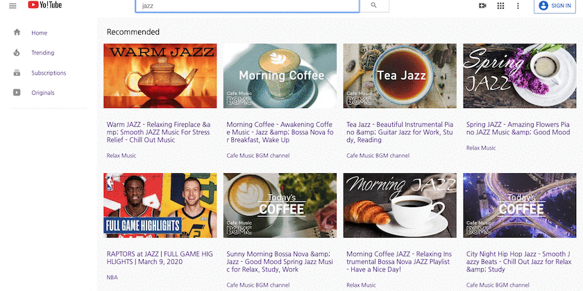

# Yo!Tube Streaming App

### live site(Currently Under Construction): https://nameless-tor-08849.herokuapp.com/

---
## Technology

- React

- JavaScript

- CSS

- HTML

--Webpack

---
## Motivation

This application aims at the web product clones Youtube site. It can stream Youtube's video and other API data. 

---
## Deployment
`npm start` or `yarn start`

## Features

### User Account

### Upload Videos

### Edit, Delete

### Search Videos

---
## Future Features to Come

- Comments
- Like and Dislike
- Interconnection with other api 
- API Reference

